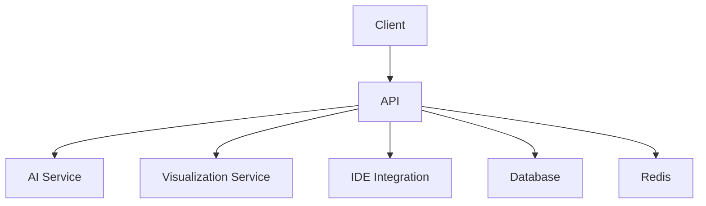
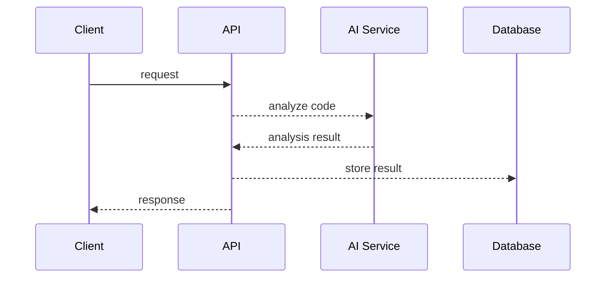
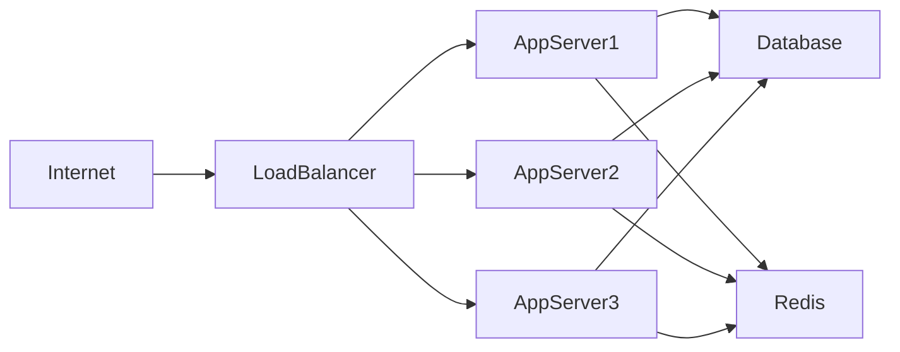
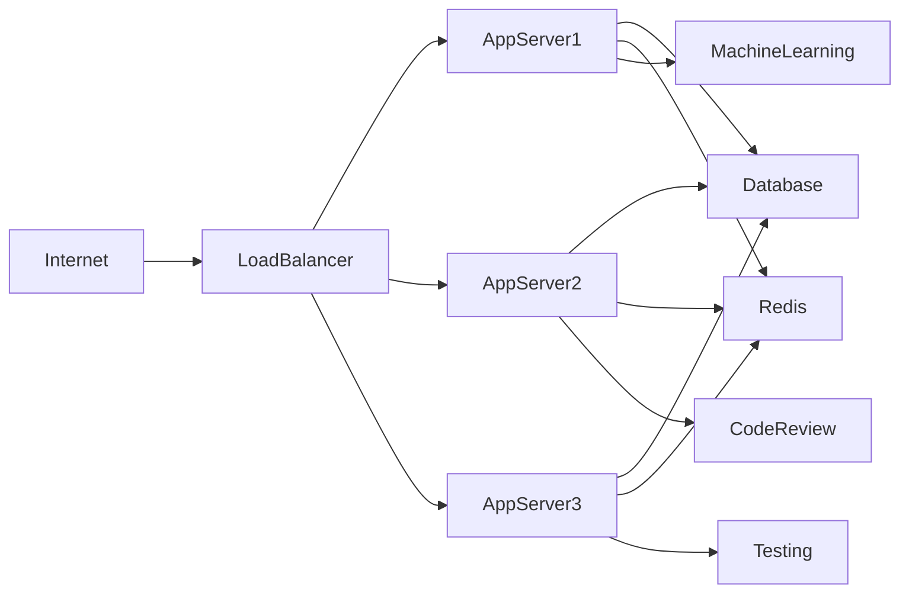

# ARCHITECTURE.md
## System Overview
The ai-codemap project aims to generate interactive code maps to help developers understand complex codebases. At the C4 Context level, the system can be represented as follows:
```mermaid
graph TD
  A[Developer] -->|uses|> B(ai-codemap)
  B -->|integrates with|> C[IDE]
  B -->|stores data in|> D[Database]
  B -->|uses|> E[AI Service]
  B -->|uses|> F[Visualization Service]
```
This diagram illustrates the key actors and systems that interact with the ai-codemap system.

## Container Architecture
The ai-codemap system consists of the following containers:
* **API**: Handles incoming requests from clients and routes them to the relevant services.
* **AI Service**: Analyzes code and generates interactive code maps.
* **Visualization Service**: Generates visual representations of the code maps.
* **IDE Integration**: Integrates the ai-codemap system with Integrated Development Environments (IDEs).
* **Database**: Stores data generated by the ai-codemap system.
* **Redis**: Used for caching and queuing.
The following diagram illustrates the relationships between these containers:

The API container acts as the entry point for the system, while the AI Service, Visualization Service, and IDE Integration containers provide the core functionality. The Database and Redis containers provide data storage and caching/queuing capabilities, respectively.

## Component Breakdown
The ai-codemap system consists of the following key components:
* **ai_service.py**: Handles code analysis and generation of interactive code maps.
* **visualization_service.py**: Generates visual representations of the code maps.
* **ide_integration.py**: Integrates the ai-codemap system with IDEs.
* **database.py**: Handles data storage and retrieval.
* **redis_client.py**: Handles caching and queuing using Redis.
* **api.py**: Handles incoming requests and routes them to the relevant services.

The following table illustrates the responsibilities of each component:

| Component | Responsibility |
| --- | --- |
| ai_service.py | Code analysis, interactive code map generation |
| visualization_service.py | Visual representation generation |
| ide_integration.py | IDE integration |
| database.py | Data storage, retrieval |
| redis_client.py | Caching, queuing |
| api.py | Request handling, routing |

## Data Flow
The data flow through the ai-codemap system can be represented as follows:
1. The client sends a request to the API container.
2. The API container routes the request to the relevant service (AI Service, Visualization Service, or IDE Integration).
3. The service processes the request and generates a response.
4. The response is stored in the Database container.
5. The client retrieves the response from the API container.
The following sequence diagram illustrates the data flow:

## Design Patterns Used
The ai-codemap system uses the following design patterns:
* **Microservices Architecture**: The system is composed of multiple containers, each providing a specific service.
* **Request-Response Pattern**: The API container handles incoming requests and routes them to the relevant services.
* **Repository Pattern**: The Database container provides a centralized data storage and retrieval system.
The rationale for using these design patterns is to provide a scalable, maintainable, and flexible system that can be easily extended to meet future requirements.

## Scalability Considerations
To ensure scalability, the ai-codemap system uses the following strategies:
* **Horizontal Scaling**: The system can be scaled horizontally by adding more containers to handle increased traffic.
* **Caching**: The Redis container is used for caching, reducing the load on the Database container.
* **Queuing**: The Redis container is also used for queuing, allowing the system to handle a high volume of requests.
The following diagram illustrates the scalability considerations:

## Security Model
The ai-codemap system uses the following security measures:
* **Authentication**: Clients must authenticate with the API container before accessing the system.
* **Data Encryption**: Data stored in the Database container is encrypted.
* **Input Validation**: The API container validates incoming requests to prevent SQL injection and cross-site scripting (XSS) attacks.
The following table illustrates the security measures:

| Measure | Description |
| --- | --- |
| Authentication | Client authentication |
| Data Encryption | Data stored in Database container is encrypted |
| Input Validation | Prevents SQL injection and XSS attacks |

## Technology Rationale
The ai-codemap system uses the following technologies:
* **Python**: Chosen for its simplicity, flexibility, and large community of developers.
* **FastAPI**: Chosen for its high performance, ease of use, and support for asynchronous programming.
* **PostgreSQL**: Chosen for its reliability, data consistency, and support for advanced database features.
* **Redis**: Chosen for its high performance, support for caching and queuing, and ease of use.
* **Docker**: Chosen for its containerization capabilities, ease of use, and support for deployment on multiple platforms.
The rationale for choosing these technologies is to provide a scalable, maintainable, and flexible system that can be easily extended to meet future requirements.

## Deployment Architecture
The ai-codemap system is deployed using the following architecture:

The system is deployed on multiple AppServer containers, each running a instance of the ai-codemap system. The LoadBalancer distributes incoming traffic across the AppServer containers, ensuring that no single container is overwhelmed. The Database and Redis containers provide centralized data storage and caching/queuing capabilities, respectively.

## Future Architecture Evolution
The ai-codemap system is designed to be flexible and extensible, allowing for future architecture evolution. Some potential future developments include:
* **Machine Learning Integration**: Integrating machine learning algorithms to improve the accuracy of code analysis and interactive code map generation.
* **Additional Services**: Adding new services to provide additional functionality, such as code review or testing.
* **Cloud Deployment**: Deploying the system on a cloud platform to take advantage of scalability and cost-effectiveness.
The following diagram illustrates the potential future architecture:

This diagram illustrates the potential future architecture, with additional services and machine learning integration.